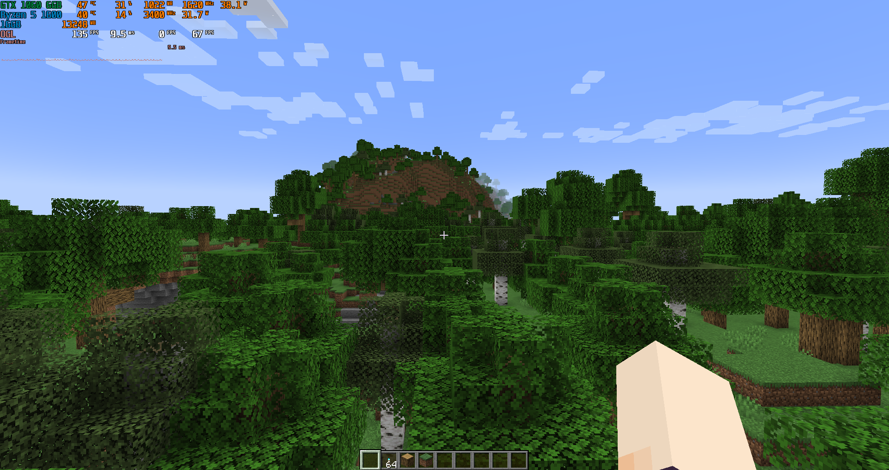
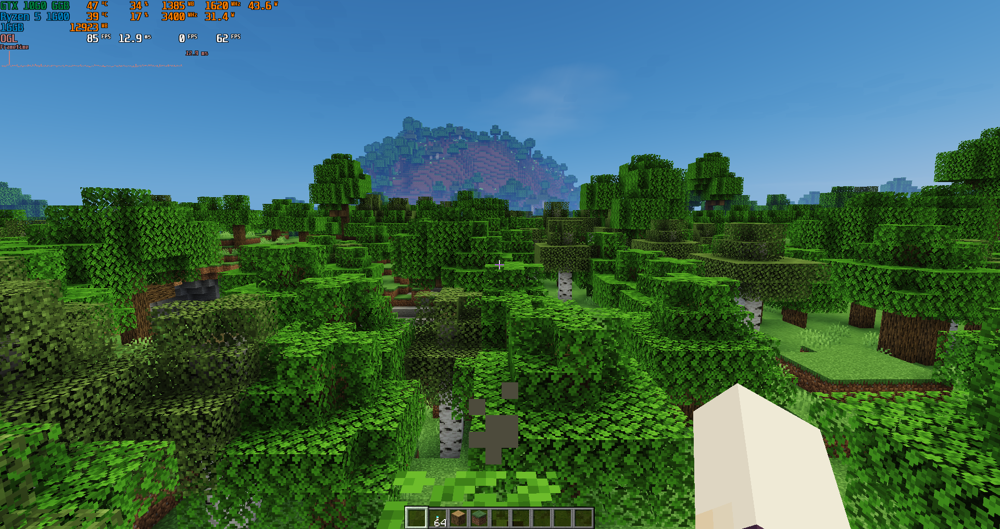

# Melhores configurações para Minecraft Java + Shaders Lagless

[Voltar](../index.md)

Eu me senti inspirado a criar esse tutorial, pois alguns dos meus amigos passam por problemas de FPS ao jogar o jogo, mesmo com um PC _mid/high end_ (Roda muito jogo AAA, mas não roda mine direito??? Sem sentido)

> ⚠️ **Aviso importante**: caso queira mais facilidade para a instalação do JRE e JDK, meu script para o Windows possui instalação de softwares com 1 clique (estilo Ninite, só que nativo do sistema)

- **Link**: _<https://github.com/LeDragoX/Win-10-Smart-Debloat-Tools>_

## Java JRE para o Launcher (x86/x64)

1. **Oracle Java JRE**: _<https://www.java.com/pt-BR/download/manual.jsp>_
2. **Selecione a opção**: _"Windows Off-line (64 bits)" ou "Windows Off-line" caso dê erro_

## Java JDK para o jogo

### Usando o _JDK da Oracle (x64 somente)_

- **Link**: _<https://www.oracle.com/java/technologies/downloads/>_ (Última versão sempre)

1. Procure por _Java SE Development Kit xx.x.x... downloads_;
2. Agora por "_Windows_" e "_x64 Installer_" em seguida;
3. Baixe e instale essa versão.

### Usando o _JDK da Adoptium_ (Open-source)

- _<https://adoptium.net/temurin/releases>_ (Última versão sempre)

Na tabela, por cima, tem várias configurações, faça desse jeito:

- **Operating System**: Windows
- **Architecture**: x64 (x86 se der erro)
- **Package Type**: JDK
- **Version**: A de maior número

1. Agora que a tabela está menor, só pegar a mais recente na data e baixar o arquivo **.msi**;
2. Instale o JDK.

## Launcher para o Minecraft

> Serve tanto para versões "alternativas" quanto a original

- _<https://tlauncher.org/en/>_

> o TLauncher já configura todos os argumentos Java, de resto é só configurar a versão JDK (ou deixar padrão)

Entre na sua conta e siga com a configuração...

## Alterando o JDK do TLauncher (Opcional)

1. Clique na `engrenagem` localizada no canto inferior direito > vá em `Configurações`;
   1. Agora se prepare para passar por uma localização errada e interface bugada;
2. Vá em `Seleção Java:` e selecione `Mudar`;
3. Clique em `Procurar...`;
4. A partir desse ponto as pastas variam, caso esteja usando o JDK da Oracle ou Adoptium JDK, leia com atenção;
   1. **Pasta do JDK da Oracle (x64)**: C:\Program Files\Java\jdk-xx.x.x (ex: jdk-18.0.1);
   2. **Pasta do JDK da Oracle (x86)**: C:\Program Files (x86)\Java\jdk-xx.x.x (ex: jdk-18.0.1);
   3. **Pasta do JDK da Adoptium**: C:\Program Files\Eclipse Adoptium\jdk-xx.x.x.x-hotspot (ex: jdk-18.0.36-hotspot);
5. Se foi selecionado corretamente, é só apertar o botão `Reter`, todos os argumentos já foram configurados automaticamente;
6. Aperte no `X` para fechar;
7. Onde está `Seleção Java:` troque de `Por padrão` para o JDK adicionado;
8. Após isso é só clicar em `Reter`.

> Ainda não acabou, vá para a próxima etapa

## Configurações importantes do Launcher

1. Clique na `engrenagem` localizada no canto inferior direito > vá em `Configurações`;
   1. Agora se prepare para passar por uma localização errada e interface bugada;
2. Logo abaixo há uma opção para alterar a RAM utilizada pela _JVM_, `Distinguir memória:`
   1. Se possível, deixe pelo menos 4096 (4GB x 1024), para minecraft vanilla é o suficiente;
3. Agora clique em `Reter`.

## Instalando o Optifine

O Launcher te permite 4 variantes das versões mais recentes/famosas:

- Vanilla (sem mods);
- OptiFine;
- Forge;
- Fabric e;
- LiteLoader.

> O problema é que o OptiFine costuma vir desatualizado, por isso escolha a versão Forge

Baixe o OptiFine direto do link oficial

- Link: <https://optifine.net/downloads>

Dentre as versões do site, escolhe a versão que se encaixa com a que você quer.

Agora é só salvar o arquivo `.jar` na pasta de mods do Minecraft.

### Entrando na pasta de mods do minecraft

Para encontrar a pasta de mods rapidamente basta segurar e soltar as teclas `Windows + R`.

Digite `%AppData%` e aperte `ENTER`, entre na pasta `.minecraft`.

> Se não existir a pasta "mods", clique com o botão direito do mouse e crie uma nova pasta com esse nome.

E então entre na pasta e coloque ali o arquivo `.jar` do OptiFine.

_Seu minecraft agora está configurado para iniciar, não desanime, falta só a configuração dentro do jogo_.

## Configurações gráficas

Abra o TLauncher e clique em `Entrar no jogo` para abrir o Minecraft.

Vá em `Options...` > `Video Settings...`

> Configure o FOV como preferir.

Aparecerá um menu como esse:

**Graphics**: só deixe no _Fast_ se realmente estiver lento
**Smooth Lighting**: só deixe no _OFF_ se realmente fizer diferença
**Render distance**: essa opção é a mais pesada, depende tanto da CPU como de GPU, começa em `8`, no meu caso `16` foi a que funcionou melhor para mim, após esse valor do preset, começa a ter travamentos e quedas altas de FPS.

### Agora a cereja do bolo

Clique em `Performance...`.

Deixe as opções como estão na imagem abaixo, deixando _OFF_ somente `Smooth FPS`, que por alguma razão diminui muito o FPS.

## Shaders que não fazem o PC explodir

Vale lembrar que shaders atrapalham na performance, mas melhoram muito a qualidade visual do jogo, então use somente se quiser

> Baixe um desses shaders e coloque na pasta .minecraft\shaderpacks\

O download geralmente fica perto do final da página, sempre pegue a versão _Lite_ para ter um melhor desempenho.

|                  Name                   |                                                Link                                                |
| :-------------------------------------: | :------------------------------------------------------------------------------------------------: |
|      Lagless shaders (Recommended)      | <https://www.9minecraft.net/lagless-shaders-mod> <https://minecraftred.com/lagless-shaders-mod> |
| SFLP Shaders (Shaders for Low End PC’s) |         <https://www.9minecraft.net/sflp-shaders> <https://wminecraft.net/sflp-shaders>         |
|         "Lagless" shaders list          |                         <https://shadersmods.com/category/lagless-shaders>                         |

### Comparando _sem vs. com_ _shaders_

**Antes**:

**Depois**:

**Nota**: Usando Lagless shaders Lite

> Feito com 💜 por LeDragoX
